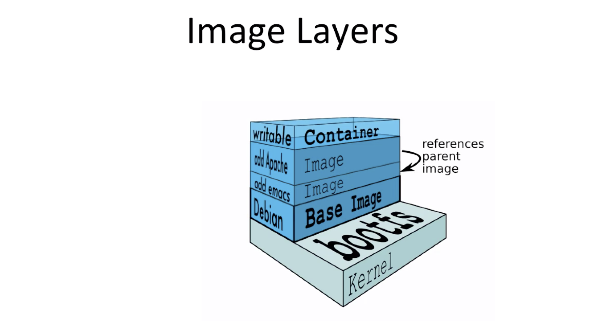
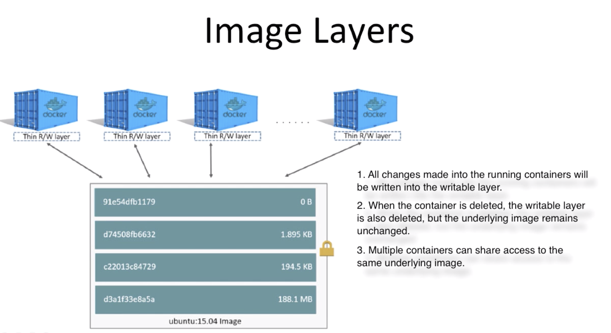

# docker info
###docker busybox
docker run repository:tag

Start container in detatched mode  
-d option
docker run -d repository:tag

docker run --rm busybox:1.24 sleep 4 
run --name hello_world busybox:1.24
docker inspect 29433fb8d9c0fc101afbf214719accab63b19e1fe1069465613da53d1fb89c4a


docker run -it -p 8888:8080 tomcat:8.0
localhost 8888


docker history repository:ver



Build container using Docker file. 
```sh
docker build -t jaynejacobs/debian .


Step 1/4 : FROM debian:jessie
 ---> 7cd9fb1ee74f
Step 2/4 : RUN apt-get update
 ---> Using cache
 ---> c0955ba4cd3e
Step 3/4 : RUN apt-get install -y git
 ---> Using cache
 ---> 7388e44900d2
Step 4/4 : RUN apt-get install -y vim
 ---> Using cache
 ---> 38503ee5f2c7
```

to commit changes to a container:
Option1. use Dockerfile
Option2. make changes within container and use commit command. 
docker commit container_ID repository_imagename

```ex. 
docker commit 4abff150ac78 jaynejacobs/debian:1.0
docker run -it jaynejacobs/debian:1.0

```

# Docker file Run Commands
chain RUN Commands to reduce image layers. 
as 

```
FROM debian:jessie
RUN apt-get update && apt-get install -y \
git \
vim 
```

instead of 

```
RUN apt-get update
RUN apt-get install -y git
RUN apt-get install -y vim
```
###CMD instruction
default is bash

runs when container starts
## Docker Cache
When docker executes an instruction it builds an image layer. 
If it existed before it will not build it again. 

Aggressive Caching causes issues
invalidate cache 
 use --no-cache=true

 COPY images  Docker/images

 use ADD  to download a file from the internet and copy to the container. 

 ### Tag and push docker container

```
docker tag 22bdc099de7d jaynejacobs/debian:1.0.2
docker images
docker login --username=jaynejacobs
docker push  jaynejacobs/debian:1.0.2
```

Dockerize APP
```
clone -b v0.1 https://github.com/jleetutorial/dockerapp.git

 docker build -t dockerapp:v0.1 .
 docker run -d -p 5000:5000 9cb07fefed9a
 docker ps 
 CONTAINER ID        IMAGE               COMMAND             CREATED             STATUS              PORTS                    NAMES
a9851a4076b7        9cb07fefed9a        "python app.py"     3 minutes ago       Up 3 minutes        0.0.0.0:

```
### Exec into container
```
docker exec -it a9851a4076b7 bash
cd /home
ls
cd admin
ps axu
```
# Updates
 git stash && git checkout v0.2
 
docker build -t dockerapp:v0.2 .

#Docker-compose
docker-compose.yml
docker-compose up -d

```sh 
$ docker-compose ps
        Name                       Command               State           Ports         
---------------------------------------------------------------------------------------
dockerapp_dockerapp_1   python app.py                    Up      0.0.0.0:5000->5000/tcp
dockerapp_redis_1       docker-entrypoint.sh redis ...   Up      6379/tcp
```


# versioning
use docker-compose build, not docker-compose up

[Redis Example](Redis.md)
